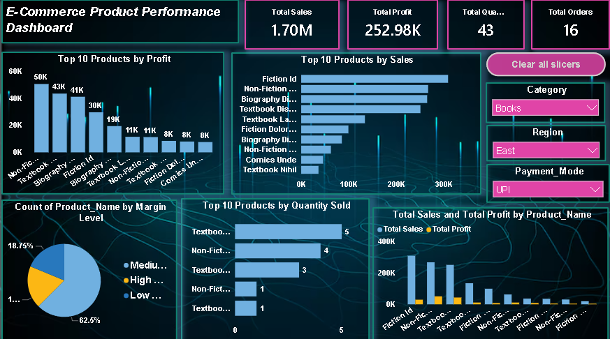
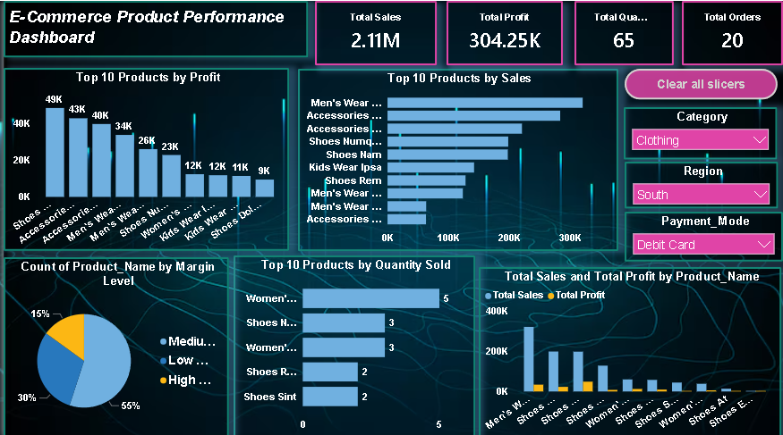

# 🛒 E-Commerce Sales — End-to-End Data Analysis

> **An end-to-end data analytics project transforming raw e-commerce data into meaningful business insights using Python, MySQL, and Power BI.**

---

## 📌 Project Overview

This project focuses on analyzing **E-Commerce Sales Data** from data preparation to business intelligence reporting.

The complete workflow includes:

**Raw Dataset → Data Cleaning → Exploratory Data Analysis → SQL Analysis → Power BI Dashboard → Business Insights**

The objective is to understand sales performance, customer behavior, product performance, profitability, and overall business trends through data-driven analysis.

---

## 🎯 Project Objectives

* Analyze overall e-commerce sales performance
* Identify top-performing products and categories
* Analyze customer purchasing behavior
* Understand sales and profit trends
* Identify high-performing regions
* Perform data cleaning and exploratory analysis
* Use SQL to extract meaningful business insights
* Build interactive Power BI dashboards
* Present findings in a structured analytical report

---

## 🛠️ Tools & Technologies

| Tool                 | Purpose                                |
| -------------------- | -------------------------------------- |
| 🐍 **Python**        | Data Cleaning, EDA & Data Analysis     |
| 🗄️ **MySQL**        | SQL Queries & Business Analysis        |
| 📊 **Power BI**      | Interactive Dashboards & Visualization |
| 📁 **CSV / Dataset** | Source Data                            |
| 📝 **Report**        | Project Findings & Business Insights   |
| 🔧 **Git & GitHub**  | Project Version Control & Portfolio    |

---

# 🔄 Project Workflow

```text
                ┌──────────────────┐
                │   Raw Dataset    │
                └────────┬─────────┘
                         ↓
                ┌──────────────────┐
                │ Data Cleaning    │
                │    & EDA         │
                │    (Python)      │
                └────────┬─────────┘
                         ↓
                ┌──────────────────┐
                │ SQL Analysis     │
                │     (MySQL)      │
                └────────┬─────────┘
                         ↓
                ┌──────────────────┐
                │ Data Visualization│
                │   (Power BI)     │
                └────────┬─────────┘
                         ↓
                ┌──────────────────┐
                │ Business Insights│
                │   & Reporting    │
                └──────────────────┘
```

---

# 🐍 1. Python Data Analysis

Python was used for:

* Data cleaning
* Handling missing values
* Removing duplicates
* Data type conversion
* Exploratory Data Analysis (EDA)
* Identifying trends and patterns
* Data visualization
* Preparing data for further analysis

### Libraries Used

```text
Pandas
NumPy
Matplotlib
Seaborn
```

---

# 🗄️ 2. MySQL Analysis

MySQL was used to perform structured queries and answer important business questions.

### SQL Analysis Includes

* Total sales analysis
* Product-wise performance
* Category-wise analysis
* Customer analysis
* Regional performance
* Sales trends
* Profit analysis
* Top-performing products
* Business KPI calculations

---

# 📊 3. Power BI Dashboard

Power BI was used to create interactive dashboards for exploring the business performance.

The dashboards provide insights into:

* Sales
* Profit
* Orders
* Customers
* Products
* Categories
* Regions
* Trends and performance

---

# 📈 Dashboard Preview


---

## 📊 Dashboard 1



---

## 📊 Dashboard 2


---

# 🔍 Key Analysis Areas

### 💰 Sales Performance

Analysis of overall sales and revenue trends.

### 📦 Product Performance

Identification of products contributing significantly to sales and profit.

### 👥 Customer Analysis

Understanding customer purchasing patterns and contribution to revenue.

### 🌎 Regional Analysis

Comparison of sales and performance across different regions.

### 📈 Time-Based Analysis

Analysis of sales trends over time to identify growth patterns and fluctuations.

### 💵 Profitability

Analysis of profit performance across products, categories, and regions.

---

# 📁 Project Structure

```text
E-Commerce-Sales-END--to---END-Data-analysis/
│
├── 📂 Dataset/
│   └── E-Commerce-Sales-Dataset.csv
│
├── 📂 Python/
│   └── E-Commerce-Sales-Analysis.ipynb
│
├── 📂 MySQL/
│   └── E-Commerce-Sales-Analysis.sql
│
├── 📂 Power BI/
│   ├── Dashboard1
│   ├── Dashboard2
│   └── Dashboard3
│
├── 📂 Report/
│   └── E-Commerce-Sales-Report.pdf
│
├── 📂 Dashboard/
│   ├── Dashboard1.png
│   ├── Dashboard2.png
│   └── Dashboard3.png
│
└── README.md
```

---

# 📋 Project Deliverables

| Component               | Description                          |
| ----------------------- | ------------------------------------ |
| 📁 **Dataset**          | Raw E-Commerce dataset               |
| 🐍 **Python**           | Data cleaning & exploratory analysis |
| 🗄️ **MySQL**           | SQL-based business analysis          |
| 📊 **Power BI**         | Interactive dashboards               |
| 📈 **Dashboard Images** | Visual dashboard previews            |
| 📝 **Report**           | Detailed project report              |

---

# 💡 Business Insights

This project helps answer questions such as:

* Which products generate the highest sales?
* Which categories perform best?
* Which regions contribute the most revenue?
* How do sales change over time?
* Which products/categories are more profitable?
* Who are the important customers?
* What are the major sales trends?

---

# 🚀 Skills Demonstrated

```text
✓ Data Cleaning
✓ Exploratory Data Analysis
✓ Python
✓ Pandas & NumPy
✓ Data Visualization
✓ MySQL
✓ SQL Queries
✓ Power BI
✓ Dashboard Development
✓ Business Intelligence
✓ Data Storytelling
✓ Business Analysis
```

---

# 📌 Conclusion

This project demonstrates an **end-to-end data analytics workflow**, starting from raw data and progressing through data cleaning, analysis, SQL querying, visualization, and business intelligence reporting.

It showcases the practical use of **Python, MySQL, and Power BI** to transform raw e-commerce data into meaningful and actionable business insights.

---

## ⭐ If you find this project useful

Feel free to explore the analysis, dashboards, SQL queries, and report included in this repository.

**Thank you for visiting this project!** 🚀

---

### 👨‍💻 Project: E-Commerce Sales — End-to-End Data Analysis

**Tools:** Python | MySQL | Power BI | GitHub
